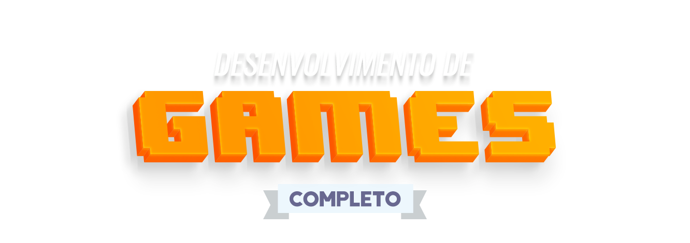

<h1 align="center">
    
</h1>

<h4 align="center">
  Já sonhou em aprender a criar e desenvolver seus próprios jogos? Este curso vai lhe ensinar como criar qualquer jogo e tudo isso utilizando a linguagem de programação Java. O curso é um diferencial no mercado pois ensina a programar em Java junto com a criação de jogos completos! E o melhor de tudo, você vai aprender como fazer seu jogo rodar em qualquer plataforma.
Com a nova atualização do curso você irá aprender engines como: Unity, Unreal, Game Maker e Godot.
</h4>
